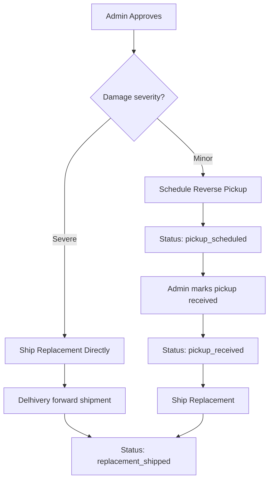

# Post-Approval Replacement Automation

After admin approves a replacement request, two paths are available:

## Flow Overview



## Proposed Changes

### Database

#### [MODIFY] [add_replacements_table.sql](file:///Users/syedejazahammed/Documents/GitHub/coreAtoms/frontend/supabase/migrations/add_replacements_table.sql)

Add new columns + update status check constraint:

- `replacement_waybill` (text) — AWB for the replacement shipment
- `replacement_tracking_url` (text)
- `reverse_waybill` (text) — AWB for reverse pickup
- `reverse_tracking_url` (text)
- Expand `status` enum: `pending → approved → pickup_scheduled → pickup_received → replacement_shipped → rejected`

> [!IMPORTANT]
> New SQL migration must be run in Supabase SQL Editor.

---

### Admin UI

#### [MODIFY] [AdminReplacements.jsx](file:///Users/syedejazahammed/Documents/GitHub/coreAtoms/frontend/src/pages/admin/AdminReplacements.jsx)

After approving, show two action buttons:
1. **"Ship Replacement Directly"** — calls `delhivery-create-shipment` with the original order's shipping address, updates status to `replacement_shipped`
2. **"Schedule Reverse Pickup"** — updates status to `pickup_scheduled` (admin arranges pickup manually via Delhivery dashboard for now, since Delhivery reverse pickup API requires warehouse registration)

For `pickup_scheduled` status → show **"Mark Pickup Received"** button → then show **"Ship Replacement"** button

---

### Customer UI

#### [MODIFY] [MyOrders.jsx](file:///Users/syedejazahammed/Documents/GitHub/coreAtoms/frontend/src/pages/MyOrders.jsx)

Update replacement status display to show all new statuses with descriptive labels + tracking links when available.

## Verification Plan

### Automated Tests
```bash
npx vite build
```
Build must pass with zero errors.
