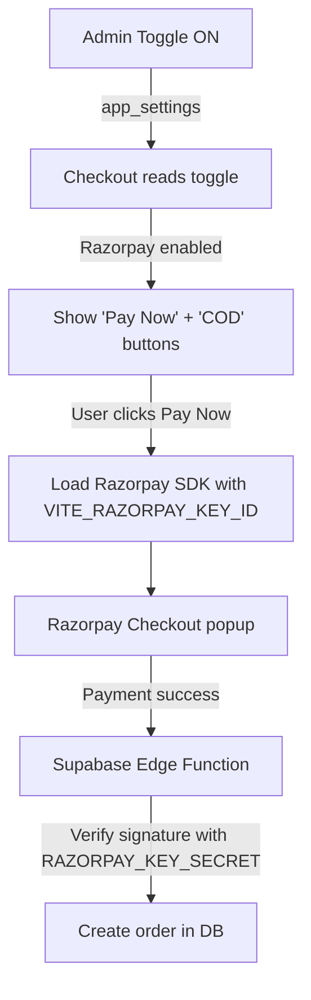

# Razorpay Payment Gateway — Toggle-Based Integration

Admin gets a simple **ON/OFF toggle** in Settings. API keys are stored securely in environment variables (never exposed on frontend). When toggled ON, checkout shows both COD and Razorpay options.

## Architecture

## Where API Keys Go (Manual Setup)

| Key | Where | How |
|-----|-------|-----|
| `VITE_RAZORPAY_KEY_ID` | Frontend `.env` | `rzp_test_xxx` or `rzp_live_xxx` |
| `RAZORPAY_KEY_ID` | Supabase Edge Function secrets | Same key as above |
| `RAZORPAY_KEY_SECRET` | Supabase Edge Function secrets | Never touches frontend |

## Proposed Changes

---

### 1. Admin Settings — Toggle Only

#### [MODIFY] [AdminSettings.jsx](file:///Users/syedejazahammed/Documents/GitHub/coreAtoms/frontend/src/pages/admin/AdminSettings.jsx)

- Add a **"Payment Gateway"** card with a styled toggle switch
- Toggle saves `{ enabled: true/false }` to `app_settings` key `razorpay_enabled`
- Shows status: "Razorpay payments are **active**" / "**disabled**"
- No API key inputs — just the toggle

---

### 2. Checkout — Dual Payment Options

#### [MODIFY] [Checkout.jsx](file:///Users/syedejazahammed/Documents/GitHub/coreAtoms/frontend/src/pages/Checkout.jsx)

- Fetch `razorpay_enabled` from `app_settings` on mount
- If enabled + `VITE_RAZORPAY_KEY_ID` env var exists:
  - Show **"Pay Now"** button (Razorpay) alongside existing **"Place order · COD"**
  - On click: open Razorpay Checkout popup → on success, call Edge Function
- If disabled: zero changes to current COD behavior

---

### 3. Razorpay Utility

#### [NEW] [razorpay.js](file:///Users/syedejazahammed/Documents/GitHub/coreAtoms/frontend/src/services/razorpay.js)

- `loadRazorpay()` — dynamically loads `checkout.js` script
- `openRazorpayCheckout({ amount, orderId, name, email, phone, onSuccess, onDismiss })` — opens popup

---

### 4. Supabase Edge Function

#### [NEW] [create-razorpay-order/index.ts](file:///Users/syedejazahammed/Documents/GitHub/coreAtoms/frontend/supabase/functions/create-razorpay-order/index.ts)

- Creates a Razorpay order via their API (uses `RAZORPAY_KEY_ID` + `RAZORPAY_KEY_SECRET` from secrets)
- Returns `razorpay_order_id` to frontend
- Frontend uses this to open the payment popup

#### [NEW] [verify-razorpay-payment/index.ts](file:///Users/syedejazahammed/Documents/GitHub/coreAtoms/frontend/supabase/functions/verify-razorpay-payment/index.ts)

- Receives `razorpay_order_id`, `razorpay_payment_id`, `razorpay_signature`
- Verifies signature using HMAC SHA256 with `RAZORPAY_KEY_SECRET`
- If valid: inserts the order into `orders` table with `payment_method = 'prepaid'`
- If invalid: returns 400 error

---

### 5. Database Migration

#### [NEW] [add_razorpay_columns.sql](file:///Users/syedejazahammed/Documents/GitHub/coreAtoms/frontend/supabase/migrations/add_razorpay_columns.sql)

- Add `payment_method` to `orders` (TEXT, default `'cod'`)
- Add `razorpay_payment_id` to `orders` (TEXT, nullable)
- Insert `razorpay_enabled` row in `app_settings`

---

### 6. Admin Orders — Payment Badge

#### [MODIFY] [AdminOrders.jsx](file:///Users/syedejazahammed/Documents/GitHub/coreAtoms/frontend/src/pages/admin/AdminOrders.jsx)

- Show `COD` / `Prepaid` badge next to order status
- Show payment ID in expanded details

## Verification Plan

1. Toggle OFF → Checkout shows COD only (no change)
2. Toggle ON + no env key → Checkout shows COD only (graceful fallback)
3. Toggle ON + env key set → Both buttons appear
4. Razorpay test payment → order created with `payment_method = 'prepaid'`
5. Admin Orders → payment badge shows correctly
